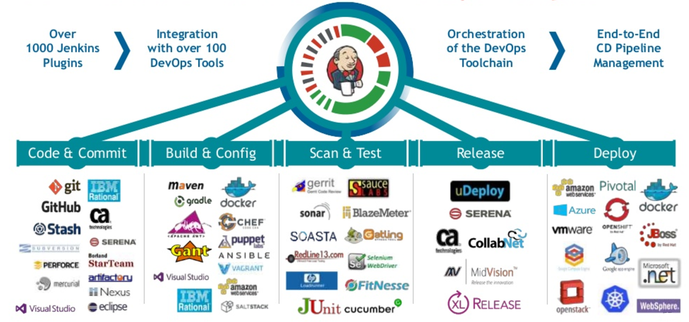

# spring-jenkins
##### Spring Boot ile test amaçlı Jenkins.

##### Jenkins, açık kaynaklı bir otomasyon sunucusudur. Yazılım geliştirmenin oluşturma, test etme ve dağıtma ile ilgili bölümlerini otomatikleştirmeye yardımcı olur, sürekli entegrasyon ve sürekli teslimatı kolaylaştırır. Apache Tomcat gibi sunucu uygulaması kaplarında çalışan sunucu tabanlı bir sistemdir.

